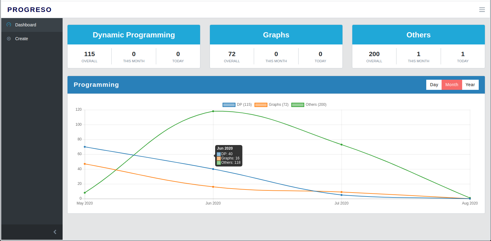
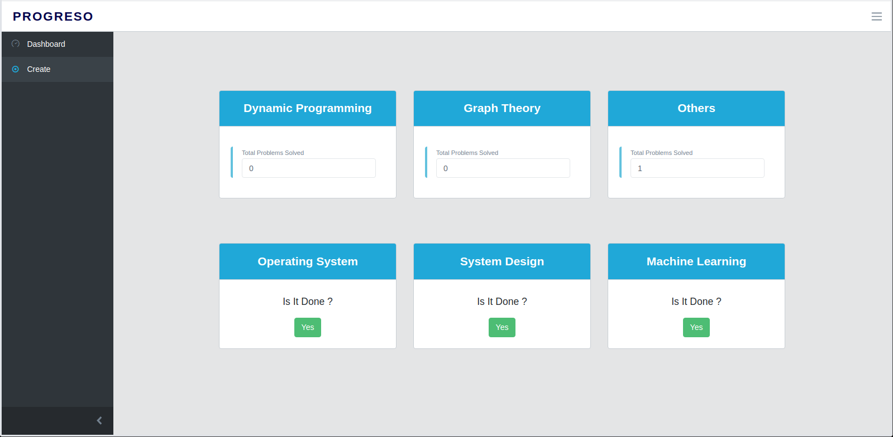

Progreso
===========

A progress tracking web application, written in python using Tornado and PostgreSQL, developed for competitive programmers and computer science students.

Details
--------

:Author: Lowjack
:Email: harshit11541@gmail.com

Technical Specs
----------------

:PostgreSQL: Relational Database System
:Tornado: Async Python Web Library + Web Server

Requirements
~~~~~~~~~~~~~~~~~~~~~~~~~~~~~~~~~~~~~~~~~

1. python 3.6+
2. tornado
3. aiohttp
4. asyncpg
5. python-dateutil

Overview
---------

This is how the application will look like

Todo
-----

1. Add Sign-up functionality.
2. Add some more analytics graphs.
